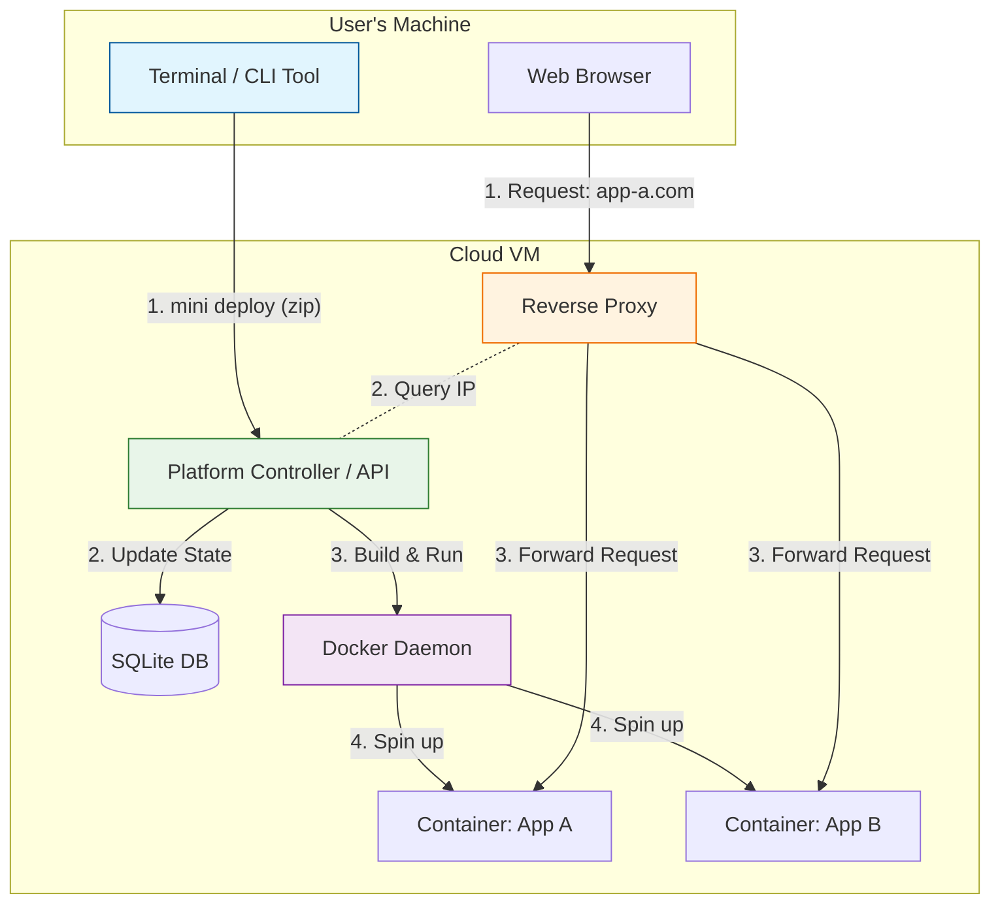

# Mini Heroku (PaaS)
**Duration:** 8 Weeks  
**Team Size:** 2 Developers  
**Focus:** Infrastructure, Systems Programming, Containerization

## 1. Project Overview
The goal of this internship is to build a simplified **Platform as a Service (PaaS)** similar to Heroku or Vercel using the **Go** programming language.

By the end of this project, you will have built a system that allows a user to type a single command (e.g., `mini deploy .`) in their terminal, which will package their source code, run it on a server, and provide a live URL (e.g., `http://my-app.localhost`) to access it.

### Core Learning Objectives
*   **Containerization Internals:** Understanding how Docker works programmatically via the Go SDK.
*   **Networking:** Understanding Reverse Proxies, DNS, and HTTP routing in Go.
*   **Systems Design:** Managing state, logs, and processes in a distributed system.
*   **CLI Design:** Building intuitive developer tools using the Cobra or any suited Go library.


## 2. High-Level Architecture
The system consists of three main components:

1.  **The CLI (Client):** A command-line tool running on the user's machine. It zips up source code and sends it to the server.
2.  **The Controller (Server):** The "brain" of the operation. It receives code, instructs the Docker Daemon to build images/run containers, and stores application metadata (SQLite).
3.  **The Reverse Proxy:** The entry point for HTTP traffic. It sits on port 80, looks at the incoming Host header (e.g., `blog.localhost`), and routes the request to the specific Docker container handling that app.

### System Diagram



## 3. Example Walkthrough

To understand the project better, here is how a developer will eventually use your platform:

### User Perspective (The CLI)
Imagine a developer has a simple web app in a folder. They will use your tool like this:
```bash
$ cd my-web-app
$ mini deploy .
[1/3] Zipping source code... Done.
[2/3] Building image "app-blue-sky"... (Docker build output follows)
[3/3] Starting container... Done.

🚀 Your app is live at: http://blue-sky.localhost
```

### Behind the Scenes (The Server Logic)
Internally, your **Controller** code will look something like this (Go code):
```go
func handleDeploy(w http.ResponseWriter, r *http.Request) {
    // 1. Receive the code zip file from the CLI
    // 2. Extract it to a temporary folder
    // 3. Call Docker SDK: 
    // docker.ImageBuild(ctx, buildContext, types.ImageBuildOptions{...})
    
    // 4. Start the container and get its internal IP
    // 5. Tell the Proxy: "Route 'blue-sky.localhost' to this IP"
}
```

## 4. Weekly Roadmap

### Phase 1: Getting Started with Docker (Weeks 1-2)
*Goal: Learn to control Docker with Go.*

#### **Week 1: Docker SDK Fundamentals**
Instead of typing `docker run`, you will write Go code to do it for you.
*   **Objectives:**
    *   Set up the Go development environment.
    *   Connect to the Docker Daemon via the official Go SDK (`github.com/docker/docker/client`).
    *   Write a Go program to pull an image and start a container.
    *   List currently running containers and their ports via code.
*   **Deliverable:** A Go binary that spins up a "Hello World" container and prints its ID.

#### **Week 2: The Builder**
Turning raw source code into a runnable image.
*   **Objectives:**
    *   Create a sample user app (e.g., a simple Go web server with a `Dockerfile`).
    *   Implement a Go API endpoint that accepts a `.tar.gz` of source code.
    *   Use the Docker SDK to `ImageBuild` an image from that source code.
*   **Deliverable:** A Go function that returns a Docker Image ID from a source archive.

### Phase 2: Moving to the Cloud (Week 3)
*Goal: Moving from "It works on my machine" to "It works on the Cloud".*

#### **Week 3: Cloud Migration & CI/CD**
Instead of running the server locally, we will deploy it to a real Cloud VM.
*   **Objectives:**
    *   **Provisioning:** SSH into the provided Cloud VM and install Docker and Go.
    *   **CI/CD Pipeline:** Create a GitHub Action that triggers on every `git push`:
        1.  Builds the Go binary.
        2.  Transfers it to the VM (via SCP/SSH).
        3.  Restarts the systemd service.
*   **Deliverable:** A pipeline where merging code automatically updates the live server on the VM.


### Phase 3: Building the Core Logic (Weeks 4-5)
*Goal: Routing traffic and managing persistence in a production environment.*

#### **Week 4: The Reverse Proxy**
Routing requests from the internet to the correct container.
*   **Objectives:**
    *   Implement dynamic routing using `httputil.ReverseProxy`.
    *   Configure DNS (or `/etc/hosts` for testing) to point subdomains to the VM's public IP.
    *   Handle `app-a.vm-ip.nip.io` -> Container A.
*   **Deliverable:** Accessing containers via public URLs.

#### **Week 5: State & Persistence**
Remembering what is running.
*   **Objectives:**
    *   Implement SQLite for state management.
    *   Ensure database persistence across deployments (if you deploy a new server version, the DB should remain intact on the VM).
*   **Deliverable:** A restartable platform on the cloud.


### Phase 4: Finishing Touches (Weeks 6-8)
*Goal: Tying it all together for the user.*

#### **Week 6: The CLI Tool**
*   **Objectives:**
    *   Build the `mini` CLI.
    *   Add a config command to point the CLI to the Cloud VM URL (e.g., `mini config set-host http://1.2.3.4`).
    *   Implement `mini deploy` to upload code to the remote server.
*   **Deliverable:** Deploying an app from a laptop to the Cloud VM.

#### **Week 7: Observability & Reliability**
*   **Objectives:**
    *   Implement `mini logs` to stream logs from the remote container.
    *   **Challenge:** Add basic authentication (API Key) so only authorized users can deploy.
*   **Deliverable:** Secure and observable deployments.

#### **Week 8: Documentation & Demo**
*   **Objectives:**
    *   Final code cleanup.
    *   **The Demo:** You will present the project by deploying a fresh app to the live Cloud VM.


## 5. Technical Stack
*   **Language:** Go (Golang)
*   **Container Engine:** Docker (via Go SDK)
*   **Database:** SQLite
*   **CLI Framework:** Cobra
*   **Proxy:** Go `net/http/httputil`

## 6. Working Agreements & Expectations
We treat this internship as a simulation of a real engineering environment.

*   **The 3-Hour Rule:** If you are stuck on a specific error for more than 3 hours, stop and ask for help. We want you to struggle enough to learn, but not enough to burn out.
*   **Quality > Speed:** It is better to have a fully working "Hello World" deployment than a broken complex system.
*   **Understanding is Key:** During code reviews, we will ask "Why?". You must be able to explain every line of code you write.
*   **Collaborate:** You are a team. Don't split the work in silos (e.g., "I do server, you do CLI"). Pair program on the hard parts.
